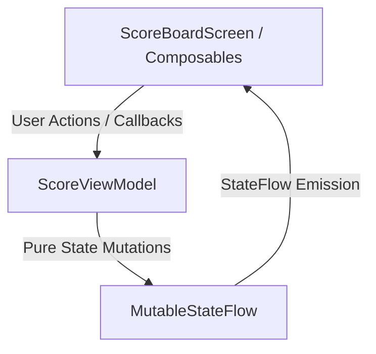

# Cricket Scorekeeper 🏏

Production-grade Android application built with **Kotlin**, **Jetpack Compose (Material 3)**, and **Unidirectional State Flow (`StateFlow`)**. Strictly implements the ICC Playing Conditions including the Duckworth-Lewis-Stern (DLS) method, Free Hit persistence, Run Out strike rotation, and automated bouncer penalties.

[](https://sonarcloud.io/summary/new_code?id=ntnkeshri)
[](https://sonarcloud.io/summary/new_code?id=ntnkeshri)
[](https://sonarcloud.io/summary/new_code?id=ntnkeshri)
[](https://sonarcloud.io/summary/new_code?id=ntnkeshri)
[](https://github.com/ntnkeshri/CricketScorekeeper/actions/workflows/sonar.yml)

---

## 🌟 Key Features & ICC Rule Implementations

- **Duckworth-Lewis-Stern (DLS) Calculator (DLS Standard Resource Matrix)**: Automatically recalculates target scores when match overs are reduced during Second Innings.
- **Free Hit Mechanism (ICC Law 21.19)**: Triggers automatically on No Balls (`Nb`) and persists through Wides/No Balls until a legal delivery is bowled. Standard dismissals (Bowled, Caught, LBW, Stumped) are disabled in the UI during a Free Hit.
- **Run Out Dismissal Engine (ICC Law 38)**: Decouples team wickets from bowler wickets (0 bowler credit). Calculates strike rotation based on runs completed, crossing of batters, and which batter was run out.
- **Compounding Extras (ICC Law 21 & 22)**: Interactive selectors for runs off No Balls (bat runs + 1 penalty run + Free Hit) and Wides (1 penalty run + extra wide runs).
- **Byes & Leg Byes (ICC Law 23 & 24)**: Tracks extras without crediting runs to the striker or charging runs against the bowler's figures.
- **Retired Hurt vs. Retired Out (ICC Law 25.4)**: Differentiates injury retirements (no fallen team wicket) from unsanctioned retirements (counts as team wicket, 0 bowler credit).
- **Maiden Overs Tracking**: Detects overs of 6 legal deliveries with 0 runs conceded by the bowler and formats bowler figures as `O - M - R - W`.
- **Bouncer Penalty Automation (ICC Law 41.6)**: Tracks bouncers per over (1 bouncer limit). Automatically calls a No Ball penalty + Free Hit on a 2nd short-pitched delivery.
- **PDF Scorecard Generation & MediaStore Export**: Renders match scorecards to PDF using `PdfDocument` and exports via `MediaStore.Downloads` with system notifications.
- **Dynamic Team Naming**: Editable side-by-side team names with automatic Batting / Bowling side swapping across innings.

---

## 🏛️ Architecture & Clean Code Standards

Built following modern Android architecture guidelines using **Unidirectional State Flow (MVI / MVVM)**:

```
app/src/main/java/com/androidApp/cricketscorekeeper/
├── annotations/
│   └── Requirement.kt          # Codebase-native @Requirement annotation
├── models/
│   └── MatchModels.kt          # Immutable domain data classes (MatchState, Records)
├── viewmodel/
│   └── ScoreViewModel.kt       # Rules engine & pure StateFlow mutations
├── ui/
│   ├── dialogs/
│   │   └── MatchDialogs.kt     # Isolated composable dialogs (Wicket, DLS, Extras, Retire)
│   └── screens/
│       └── ScoreBoardScreen.kt # Declarative Material 3 Compose screen layouts
└── utils/
    └── PdfGenerator.kt         # PDF document generation & MediaStore export
```

### Unidirectional State Flow



---

## 🧪 Quality Assurance & CI/CD Pipeline

Targeting **90%+ Code Coverage** through multi-layered automated testing:

| Test Layer | Framework / Tools | Scope |
|---|---|---|
| **Unit Tests** | JUnit4 + `kotlinx-coroutines-test` | StateFlow emissions, ICC rule engines, DLS math, strike rotation, lockouts (`ScoreViewModelTest.kt`) |
| **Compose UI Tests** | `compose:ui-test-junit4` | Input field bindings, dialog expansion/dismissal, dynamic AssistChip list rendering (`ScoreBoardScreenTest.kt`) |
| **Intent Tests** | Espresso Intents | PDF export verification firing `ACTION_VIEW` intent with `application/pdf` MIME type (`PdfIntentTest.kt`) |
| **Matrix Traceability** | Custom Gradle Task (`generateRtm`) | Codebase-native requirement scanning generating markdown matrix (`RTM.md`) |
| **Continuous Integration** | GitHub Actions + JaCoCo + SonarCloud | Automated build, test, coverage report generation, and SonarCloud analysis |

### Automated Requirement Traceability Matrix (RTM)

The project includes an automated Gradle task (`./gradlew generateRtm`) that scans all Kotlin source and test files for `@Requirement` annotations and builds an up-to-date [RTM.md](file:///Users/ntnkeshri/AndroidStudioProjects/CricketScorekeeper/RTM.md) document mapping ICC Playing Conditions directly to their implementation functions and unit tests.

---

## 🛠️ Tech Stack & Dependencies

- **Language**: Kotlin 2.x
- **UI Framework**: Jetpack Compose (Material 3)
- **State Management**: `StateFlow`, `ViewModel` (Lifecycle Compose)
- **Concurrency**: Kotlin Coroutines & Flows
- **PDF & Storage**: `android.graphics.pdf.PdfDocument`, `MediaStore.Downloads`
- **Testing**: JUnit4, `kotlinx-coroutines-test`, `compose:ui-test-junit4`, Espresso Intents
- **Device Orchestration**: Gradle Managed Devices (`pixel6Api33`, `pixelTabletApi33`)
- **Coverage & Static Analysis**: JaCoCo, SonarCloud, GitHub Actions

---

## 🚀 Building & Running

### Prerequisites
- Android Studio Ladybug or newer
- JDK 17 (Temurin recommended)
- Android SDK 34 / 37

### Build Commands

1. **Assemble Debug Application**:
   ```bash
   ./gradlew :app:assembleDebug
   ```

2. **Run Unit Test Suite**:
   ```bash
   ./gradlew :app:testDebugUnitTest
   ```

3. **Generate JaCoCo Coverage Report**:
   ```bash
   ./gradlew jacocoTestReport
   ```

4. **Generate Requirement Traceability Matrix (RTM)**:
   ```bash
   ./gradlew generateRtm
   ```

5. **Run Instrumentation Tests on Gradle Managed Devices**:
   ```bash
   ./gradlew pixel6Api33DebugAndroidTest
   ```

6. **Trigger SonarCloud Static Analysis**:
   ```bash
   ./gradlew jacocoTestReport sonar --info
   ```
